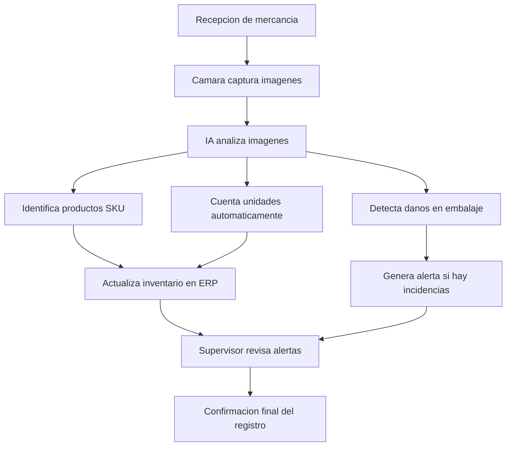

# Práctica IA (RA4 · a) — Automatización y optimización

## 1) Proceso elegido
- Nombre del proceso: Control automático de inventario en almacén
- Contexto (empresa/servicio web/IT): Empresa de logística y distribución de comercio electrónico
- Rol/es implicados:

  - Operario de almacén

  - Supervisor de inventario

  - Responsable de logística

  - Sistema ERP

## 2) ANTES (sin IA)
- Pasos (5–7):
  1. El operario recibe mercancía.
  2. Escanea manualmente cada producto con lector de código de barras.
  3. Introduce cantidades en el sistema ERP.
  4. Revisa visualmente posibles daños.
  5. Actualiza el stock manualmente.
  6. El supervisor verifica inconsistencias.
     
- Tiempo aproximado por caso: 3–5 minutos por palé recibido.
- Problemas / cuellos de botella:
  - Errores humanos en conteo.

  - Productos mal registrados.

  - Retrasos en horas pico.

  - Dificultad para detectar productos dañados.

## 3) DESPUÉS (con IA)
- ¿Qué automatiza la IA?
  - Reconocimiento automático de productos mediante cámaras.
  - Conteo automático de unidades.
  - Detección de daños en embalajes.
  - Actualización automática del inventario en el ERP.
- ¿Qué queda para humanos?
  - Supervisión de alertas.
  - Gestión de incidencias complejas.
  - Control de calidad final.
- Datos necesarios (tipos de datos, sin datos personales):
  - Imágenes de productos.
  - Base de datos de referencias SKU.
  - Historial de inventario.
  - Registro de productos defectuosos.
- Modelo/técnica (NLP, clasificación, recomendación, visión, etc.):
  - Visión por computador (Computer Vision).
  - Redes neuronales convolucionales (CNN).
  - Detección de objetos tipo YOLO.
  - Integración con sistemas ERP como SAP.

## 4) Optimización (mejora medible)
Define 3 métricas con valores antes/después:
- Tiempo:
  - Antes: 5 min por palé
  - Después: 1 min por palé
  - Mejora: −80%
- Coste:
  - Antes: 4 operarios por turno
  - Después: 2 operarios + sistema automatizado
  - Reducción estimada: 35% en costes operativos
- Calidad:
  - Antes: 85% precisión en inventario
  - Después: 98% precisión tras entrenamiento del modelo

## 5) Diagrama del flujo (ASCII o Mermaid)

## 6) Riesgos y mitigación
- Riesgo 1: Fallos en reconocimiento por mala iluminación.
- Mitigación 1: Instalación de iluminación controlada y reentrenamiento con distintos escenarios.
- Riesgo 2: Dependencia tecnológica ante caídas del sistema.
- Mitigación 2: Sistema manual de respaldo y copias de seguridad automáticas.

## 7) Fuente oficial
- Enlace: https://www.sap.com/products/scm/extended-warehouse-management.html
