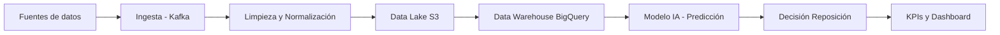

# Práctica IA (RA4 · b+c) — Big Data, análisis, rentabilidad y valoración IA

## 1) Caso y objetivo de negocio
- Empresa/sector (real o ficticia): Zara (retail moda, grupo Inditex)
- Problema a resolver: Exceso de stock en algunas tiendas y roturas de stock en otras por mala previsión de demanda.
- Objetivo de negocio (rentabilidad): (reducir costes / aumentar ventas / reducir riesgos / etc.)
    - Reducir costes logísticos y de inventario + aumentar ventas mediante mejor previsión y reposición automática.

## 2) Big Data: recogida masiva de datos
Describe por qué es Big Data (volumen, velocidad, variedad).
- Volumen: millones de transacciones diarias en tiendas físicas y online.
- Velocidad: datos en tiempo real (ventas por minuto, clics web).
- Variedad: datos estructurados (ventas), semiestructurados (logs web) y no estructurados (comentarios en redes).
- Fuente 1: Ventas en TPV (tickets, productos, hora, tienda).
- Fuente 2: Datos de la web/app (clics, carritos abandonados, búsquedas).
- Fuente 3: Redes sociales (tendencias, comentarios, hashtags).
- Volumen/velocidad (estimación): >5 millones de transacciones/día; actualización en streaming cada pocos segundos.
- Formatos: Series temporales (ventas), texto (comentarios), eventos (clics), imágenes (catálogo).

## 3) Tratamiento/análisis: pipeline de datos
Explica el flujo de forma ordenada:
- Ingesta (captura/eventos): APIs y streaming (ej. Apache Kafka).
- Limpieza/normalización: Eliminación de duplicados, tratamiento de valores nulos, unificación de formatos de fecha y moneda.
- Almacenamiento (data lake/warehouse): Data Lake en Amazon S3 y análisis estructurado en Google BigQuery.
- Preparación de variables (features):
    - Ventas medias por día/tienda
    - Estacionalidad (rebajas, Navidad)
    - Tendencias en redes
    - Clima por ciudad
- Análisis/BI (opcional): Dashboards en Microsoft Power BI para responsables de tienda.

## 4) IA aplicada: modelo y decisión
- Tipo de IA/técnica (clasificación, predicción, recomendación, anomalías, NLP...): Predicción de demanda (machine learning supervisado, regresión con redes neuronales LSTM).
- Entrada del modelo (qué datos usa): Históricos de ventas, tendencias online, clima, calendario promocional.
- Salida del modelo (qué produce): Predicción de ventas por producto/tienda para las próximas 2–4 semanas.
- Decisión que habilita (qué hace la empresa con esa salida): Ajuste automático de reposición y producción; redistribución de stock entre tiendas.

## 5) Rentabilidad: KPIs antes/después (mínimo 3)
KPI 1 (ingresos/coste/eficiencia):
- Antes: 18% de sobrestock anual.
- Después: 10% de sobrestock.
- Por qué mejora la rentabilidad: Menor coste de almacenamiento y menos rebajas forzadas → mayor margen.

KPI 2:
- Antes: 8% de ventas potenciales perdidas.
- Después: 3%.
- Por qué mejora la rentabilidad: Mayor disponibilidad de producto → aumento directo de ingresos.

KPI 3:
- Antes: 52%.
- Después: 56%.
- Por qué mejora la rentabilidad: Menos descuentos agresivos y mejor planificación de producción.

## 6) Diagrama del pipeline (ASCII o Mermaid)

## 7) Riesgos y mitigación
Riesgo 1:
- Mitigación 1:

Riesgo 2:
- Mitigación 2:

## 8) Valoración (criterio c): importancia presente y futura de la IA (10–15 líneas)
- Importancia actual (hoy):
- Importancia futura (3–5 años):
- Condiciones/limitaciones (datos, costes, regulación, ética, seguridad, empleo):
- Conclusión razonada:

## 9) Fuentes oficiales (mín. 2)
- Big Data/analítica (enlace oficial):
- IA/técnica/modelo (enlace oficial):

