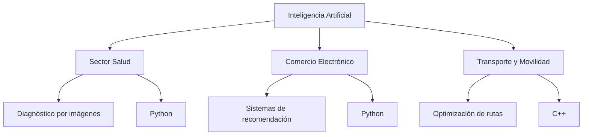

# Práctica IA (RA4 · d+e) — Sectores con implantación relevante y lenguajes de programación en IA

## 1) Introducción
**Objetivo de la práctica:**  
Analizar distintos sectores donde la Inteligencia Artificial (IA) tiene una implantación relevante, comprender qué tareas automatiza o mejora y conocer algunos de los lenguajes de programación más utilizados para desarrollar sistemas de IA.

**Relación con DAW/DAM:**  
Para los desarrolladores de **Desarrollo de Aplicaciones Web (DAW)** y **Desarrollo de Aplicaciones Multiplataforma (DAM)**, la IA es cada vez más importante. Muchas aplicaciones modernas incluyen sistemas inteligentes como chatbots, recomendadores, análisis de datos o reconocimiento de imágenes. Conocer cómo funciona la IA y qué lenguajes se utilizan permite integrarla en aplicaciones web y móviles.

---

## 2) Sectores con implantación relevante de IA

### Sector 1
- **Nombre del sector:** Salud  
- **Tipo de empresa/servicio:** Hospitales, clínicas y empresas de tecnología médica  
- **Aplicación de IA:** Diagnóstico asistido mediante análisis de imágenes médicas  
- **Qué tarea mejora o automatiza:**  
  La detección de enfermedades en radiografías, resonancias o escáneres médicos.  
- **Por qué la IA tiene implantación relevante en este sector:**  
  El sector sanitario maneja grandes cantidades de datos médicos e imágenes que pueden analizarse mediante algoritmos de aprendizaje automático.  
- **Beneficios que aporta:**  
  - Diagnósticos más rápidos  
  - Mayor precisión en la detección de enfermedades  
  - Apoyo a los profesionales sanitarios  

### Sector 2
- **Nombre del sector:** Comercio electrónico  
- **Tipo de empresa/servicio:** Tiendas online y plataformas de venta digital  
- **Aplicación de IA:** Sistemas de recomendación de productos  
- **Qué tarea mejora o automatiza:**  
  Analiza el comportamiento del usuario para recomendar productos que pueden interesarle.  
- **Por qué la IA tiene implantación relevante en este sector:**  
  Las tiendas online generan muchos datos de usuarios que pueden analizarse para mejorar la experiencia de compra.  
- **Beneficios que aporta:**  
  - Mejora de la experiencia del usuario  
  - Aumento de ventas  
  - Personalización de contenido  

### Sector 3
- **Nombre del sector:** Transporte y movilidad  
- **Tipo de empresa/servicio:** Empresas de transporte, vehículos autónomos y aplicaciones de movilidad  
- **Aplicación de IA:** Sistemas de conducción autónoma y optimización de rutas  
- **Qué tarea mejora o automatiza:**  
  Analiza datos de tráfico y sensores para decidir rutas óptimas o controlar vehículos autónomos.  
- **Por qué la IA tiene implantación relevante en este sector:**  
  El transporte necesita procesar datos en tiempo real como tráfico, sensores y mapas.  
- **Beneficios que aporta:**  
  - Reducción de accidentes  
  - Optimización de rutas  
  - Menor consumo de combustible  

---

## 3) Lenguajes de programación en IA

### Lenguaje 1
- **Nombre:** Python  
- **Uso principal en IA:** Desarrollo de modelos de aprendizaje automático y análisis de datos  
- **Ventajas:**  
  - Sintaxis sencilla  
  - Gran comunidad de desarrolladores  
  - Gran cantidad de librerías especializadas  
- **Ejemplos de uso:**  
  - TensorFlow  
  - PyTorch  
  - Scikit-learn  

### Lenguaje 2
- **Nombre:** Java  
- **Uso principal en IA:** Desarrollo de aplicaciones empresariales que integran inteligencia artificial  
- **Ventajas:**  
  - Multiplataforma  
  - Muy utilizado en sistemas empresariales  
  - Buen rendimiento y estabilidad  
- **Ejemplos de uso:**  
  - Sistemas de recomendación  
  - Chatbots empresariales  

### Lenguaje 3
- **Nombre:** C++  
- **Uso principal en IA:** Desarrollo de sistemas de alto rendimiento como visión artificial o robótica  
- **Ventajas:**  
  - Gran velocidad de ejecución  
  - Control detallado de memoria  
  - Ideal para aplicaciones en tiempo real  
- **Ejemplos de uso:**  
  - Librerías de visión por computador  
  - Sistemas de conducción autónoma  

### Lenguaje 4
- **Nombre:** R  
- **Uso principal en IA:** Análisis estadístico y ciencia de datos  
- **Ventajas:**  
  - Potente para análisis de datos  
  - Amplia colección de librerías estadísticas  
- **Ejemplos de uso:**  
  - Análisis de datos  
  - Modelos predictivos  

---

## 4) Relación entre sectores, tipo de IA y lenguaje

| Sector | Aplicación de IA | Tipo de IA/técnica | Lenguaje recomendado | Justificación |
|------|------------------|--------------------|----------------------|---------------|
| Salud | Diagnóstico por imágenes | Visión por computador / Deep Learning | Python | Dispone de muchas librerías para análisis de imágenes médicas |
| Comercio electrónico | Recomendación de productos | Sistemas de recomendación / Machine Learning | Python | Muy utilizado para análisis de datos de usuarios |
| Transporte | Optimización de rutas | IA predictiva / aprendizaje automático | C++ | Permite procesamiento rápido en tiempo real |

---

## 5) Diagrama (ASCII o Mermaid)

## 6) Riesgos y mitigación

- **Riesgo 1:** Uso incorrecto de datos personales o problemas de privacidad.  
- **Mitigación 1:** Aplicar normativas de protección de datos y anonimizar la información.

- **Riesgo 2:** Sesgos en los algoritmos que puedan producir decisiones incorrectas.  
- **Mitigación 2:** Entrenar los modelos con datos diversos y revisar los resultados periódicamente.

---

