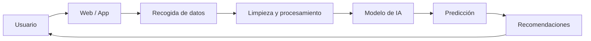

# Práctica IA (RA4 · f)

## 1) Caso de uso
- **Tipo de aplicación:** Sistema de recomendación  
- **Problema:** Los usuarios no saben qué productos elegir entre muchas opciones  
- **Usuario:** Clientes de una tienda online  

## 2) Datos
- **Datos:** Historial de compras, productos vistos, valoraciones, clics  
- **Tipo minería:** Aprendizaje supervisado + filtrado colaborativo  

## 3) Pipeline
- **Recogida:** Datos del comportamiento del usuario en la web (cookies, registros)  
- **Limpieza:** Eliminación de datos duplicados o incompletos  
- **Transformación:** Conversión a variables útiles (ej: productos más vistos, frecuencia de compra)  
- **Entrenamiento:** Modelo de recomendación (ej: KNN o redes neuronales)  
- **Predicción:** Sugerencia de productos personalizados  
- **Uso:** Mostrar recomendaciones en la página principal o carrito  

## 4) Integración
- **Backend:** API en Python (por ejemplo con Flask o FastAPI) que ejecuta el modelo  
- **Frontend:** Página web que muestra recomendaciones al usuario  
- **Flujo:**  
  Usuario entra → se recogen datos → backend procesa → modelo predice → frontend muestra recomendaciones  

## 5) Valor
- **Mejora:** Aumenta las ventas y mejora la experiencia del usuario  
- **Sin IA:** Recomendaciones genéricas iguales para todos  
- **Rentabilidad:** Incremento de ingresos y fidelización de clientes  

## 6) Diagrama

## 7) Riesgos
- Riesgo 1:
- Mitigación 1:
- Riesgo 2:
- Mitigación 2:

## 8) Fuente
